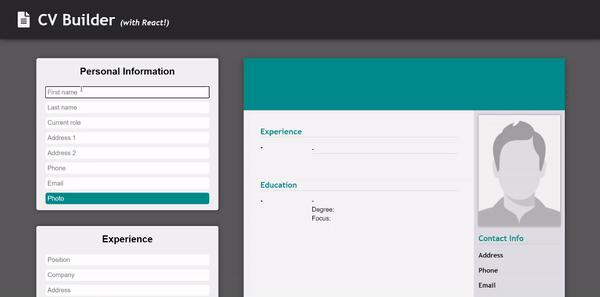
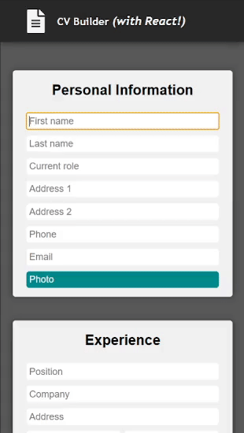

# CV Builder

<a href="https://kfig21.github.io/cv_application/" target="_blank" rel="noopener noreferrer">View the project here!</a> 👀

<h3>Summary</h3>

A CV builder built with React that instantly updates upon data entry. The app allows users to add/remove experience and education entries and even view an example of how a completed CV should look. Users can also save the CV preview as a PDF file or even print it out for their own use.

<h3>Features:</h3>

- CV dynamically updates with data entry
- Users can add a photo
- View an example CV
- Save CV as a PDF
- Print CV
- Responsive design

<h3>Demo GIFs</h3>

<h4>Desktop</h4>

<h4>Mobile</h4>

-----------------------------

<h3>Thanks for checking out my project! Any && all feedback is appreciated!</h3>

